---
excerpt:	"Knowledge, Information Technology, and the Arabic Book"
header:
  overlay_image: /images/covers/kitab2.jpg
  overlay_filter: rgba(0, 0, 0, 0.45)
  caption: "**Photo credit**: From Book three of 'Nihāyat al-su’l' which gives instructions on using lances. Dated 773/1371 (Add. MS. 18866, f. 113r)"
title:		"About KITAB"
author:		Maxim Romanov
layout:		single
author_profile: true
permalink: /about/
---



# Message from the PI 

KITAB provides a digital tool-box and a forum for discussions about Arabic texts. We wish to empower users to explore Arabic texts in completely new ways and to expand the frontiers of knowledge about one of the world’s largest and most complex textual traditions.

We are leading with a tool that detects how authors copied previous works. Arabic authors frequently made use of past works, cutting them into pieces and reconstituting them to address their own outlooks and concerns. Now you can discover relationships between these texts and also the profoundly intertextual circulatory systems in which they sit.

Our most recent work has involved gathering statistics on reuse across the tradition. This includes the extent and precision of reuse, and where it does and does not occur. We are also developing new visualisations that show the relationships between authors, books, and the ideas that they contain. Equally importantly, we are building the corpus of texts upon which our research is based, and making use of our pioneering work on Optical Character Recognition.

The technology that powers KITAB is at the cutting edge of computer science and we are deeply indebted to our partners. Our first algorithm has been developed by David Smith of Northeastern University. Gregory Crane (editor-in-chief of the Perseus Digital Library and the Alexander von Humboldt Chair in the Digital Humanities at Leipzig University) has been a major collaborator from the start on many aspects of the project. For funding, we are grateful to the support that we have received from the Aga Khan University and the British Academy.

To use our corpus and search tools, please start with "Our Pilot." This provides you with a brief view into the sort of data and tools that we are creating. It is only a sample. We are applying for funding that would allow us to bring all of our data and sources into the public domain.

Thank you for your interest in KITAB!

Kind regards, 
Sarah Bowen Savant 
Principal Investigator 
Knowledge, Information Technology, and the Arabic Book

# Our Team

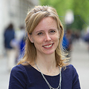{: .align-left}

### Sarah Bowen Savant Professor, AKU-ISMC, and Principle Investigator of KITAB

Sarah Bowen Savant, Professor, AKU-ISMC, and Principle Investigator of KITAB. Professor Savant is a cultural historian specialising in the Middle East and Iran ca. 600-1500. Her work on KITAB is motivated by a desire to write a cultural history of the Arabic book using digital tools. Her publications include [_The New Muslims of Post-Conquest Iran: Tradition, Memory, and Conversion_](http://www.cambridge.org/catalogue/catalogue.asp?isbn=9781107014084) (Cambridge University Press, 2013; winner of the Said-Sirjani book award given by the International Society for Iranian Studies on behalf of the Persian Heritage Foundation); as editor (with Helena de Felipe), [_Genealogy and Knowledge in Muslim Societies: Understanding the Past_](https://edinburghuniversitypress.com/book-genealogy-and-knowledge-in-muslim-societies.html) (AKU-ISMC, Exploring Muslim Contexts/Edinburgh University Press, 2014); as translator (with Peter Webb), _The Excellence of the Arabs. A Translation of Ibn Qutaybah’s_ [_Faḍl al-ʿArab wa l-tanbīh ʿalā ʿulūmihā_](https://nyupress.org/9781479809578/) (The Library of Arabic Literature/New York University Press, 2017); and numerous articles treating ethnic identity, cultural memory, genealogy, and history writing. She serves as president of [Middle East Medievalists](https://islamichistorycommons.org/mem/) and as an ex-officio member of the editorial board of its online, open-access journal, [_Al-ʿUsur al-Wusta_](https://islamichistorycommons.org/mem/al-usur-al-wusta/current-issue/). She was also a board member of the _British Institute for the Study of Iraq_, and is a member of the editorial board of its journal, _Iraq_. In 2016-17, she was a mid-career fellow of the British Academy and a fellow at the Leiden University Centre for the Study of Islam and Society. During that time she prepared much of her next book, based on KITAB’s data: _A Cultural History of the Arabic Book_ (Leiden: Brill, 2019, expected). Updates on KITAB are regularly posted on her Tweeter account: [@sarahsavant1](https://twitter.com/sarahsavant1).

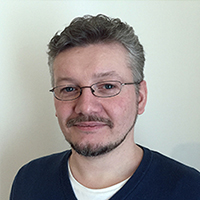{: .align-left}

### Maxim Romanov, Senior Research Fellow
Maxim Romanov is a Universitätsassistent für Digital Humanities at the Institute for History, University of Vienna. His dissertation (Near Eastern Studies, U of Michigan, 2013) explored how modern computational techniques of text analysis can be applied to the study of premodern Arabic historical sources. In particular, he studied “The History of Islam” (Taʾrīḫ al-islām), the largest of surviving biographical collections with over 30,000 biographies, written by the Damascene scholar al-Ḏahabī (d. 1348 CE). Currently, he continues his study of this biographical collection (The History of Islam: An Essay in Digital Humanities), which will serve as methodological and infrastructural foundation for the study of all surviving Arabic biographical collections and chronicles. Additionally, besides KITAB, he is working on other foundational projects for the field of Arabic and Islamic studies, which include the OpenITI (former OpenArabic), a machine-readable corpus of classical Arabic texts, and al-Ṯurayyā, a gazetteer of the classical Islamic world. For his personal website, click [here](https://alraqmiyyat.github.io/).

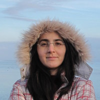{: .align-left}

### Masoumeh Seydi, Digital Lead
Masoumeh Seydi is KITAB’s Digital Lead. While completing her PhD. at the Institute of Informatics, University of Leipzig, she has been working, since 2015, in a DH group, focusing on various computational methods  to retrieve, analyze, and visualize the geographical descriptions of premodern Arabic sources. She has been applying methods to annotate and extract various descriptive informations, such as route networks and hierarchical divisions of a pre-modern society, and introducing models and visualizations for the geographical entities, comparative view of different descriptions, locating unknown places based on the contextual information. She is also involved in other projects, including [_al-Ṯurayyā_](https://althurayya.github.io/), a gazetteer of the classical Islamic world, and _Exploratorium_ which offers an exploratory insight into groups of individuals from the “History of Islām” (_Taʾrīḫ al-islām_) of al-Ḏahabī who share common ‘descriptors’.

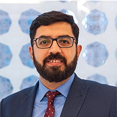{: .align-left}

### Sohail Merchant, Technical Lead

Sohail is responsible for managing the infrastructure and developing the application architecture for KITAB. He is currently working as the Lead Office 365 / SharePoint Analyst at the University of London. Prior to working at the University of London, he has worked with various organisations including the Institute of Ismaili Studies, Aga Khan University and University College London . where he has architect, managed and implemented various solutions and web applications. Sohail holds a Master of Science degree in Computing from London Metropolitan University and he is also a PRINCE2 Certified Practitioner and Microsoft Certified Solution Expert (MCSE).

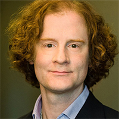{: .align-left}

### David Smith, Digital Sirah Project

David Smith is an associate professor in Northeastern University’s College of Computer and Information Science. He is a founding member of the NULab for Texts, Maps, and Networks (neu.edu/nulab), Northeastern’s center for research in the digital humanities and computational social sciences. His research in natural language processing has focused both on building statistical models of linguistic phenomena in morphology, syntax, and semantics and on applications to information retrieval, machine translation, digital libraries, the humanities, and social sciences. A common theme for much of his recent research has been inferring the structure of social, political, and communication networks from the evidence of texts that propagate over those networks. With current and former NULab colleagues Ryan Cordell, Abby Mullen, and Jonathan Fitzgerald, Prof. Smith is working on _Going the Rounds_, a book on texts “going viral” in the nineteenth century [viraltexts.org](https://viraltexts.org/). He holds a Ph.D. in computer science from Johns Hopkins University and an A.B. in Classics (Greek) from Harvard. In between, he worked as a research programmer for the Perseus Digital Library Project.

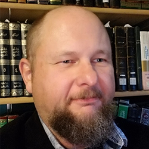{: .align-left}

### Kevin Jaques, Digital Sirah Project

Kevin Jaques is an Associate Professor of Islamic Studies in the Department of Religious Studies at Indiana University.

He is a specialist in classical Islamic biography, Islamic law, and theology as well as religious hermeneutics and comparative religions. He has written two books,  _Authority, Conflict, and the Transmission of Diversity in Medieval Islamic Law_ (Brill, 2006) and _Ibn Ḥajar al-ʿAsqalānī_ (Oxford, 2010), as well as numerous articles.

Jaques is currently working on reconstructing the various versions of Muḥammad b. Isḥāq’s _Sīrah Rasūl Allāh_, the earliest biography of the Prophet Muḥammad and one of our most important sources for understanding how Muslims in the 2nd/8th century viewed Muḥammad within the context of the rapidly expanding Muslim world. Ibn Isḥāq (d. 150/767) lived during a time of great change and produced different versions of his work as he traveled across the late Umayyad and early ʿAbbāsid Empires. Jaques’ project is to reconstruct those different versions as a window onto how Muslim worldviews developed over this period and in the different regions in which Ibn Isḥāq traveled. He is in the process of completing a collection of over 60 different witnesses to the work that he plans to publish together with a five volume series on the author and the _Sīrah_.

The first volume, The Captives of _ʿAyn al-Tamr_, will examine the first two centuries of Islam through the lens of those captured and enslaved at the Battle of ʿAyn al-Tamr (12/633), and how they and their descendants became contributors to the early Muslim tradition. Ibn Isḥāq’s grandfather, Yasār, was a child when he was enslaved at the battle and later manumitted. The lives and experiences of manumitted slaves (_mawālī_ sing. _mawlā_) is the central theme of the volume and will serve as a means of understanding many of the religious, social, economic, and political issues that helped form Ibn Isḥāq’s understanding if the world.

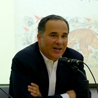{: .align-left}

### Abdul Rahman Azzam, Digital Sirah Project

With a BA and Dphil from Oxford University, Azzam’s focus is on the development of Islamic thought from the medieval to the modern Muslim world and the interaction between traditional Islam and modernity. He is the author of Saladin (2008) and The Other Exile (2017).

Since 2007 Abdul Rahman has been working at Qatar Foundation where he has led several important cultural and educational projects. He was delegated by Sheikha Moza to lead and negotiate the partnership between The British Library and Qatar Foundation. The first phase of the partnership, signed in July 2012, created a state-of-the-art online portal of materials on Gulf History with over half a million documents digitised. Abdul Rahman also negotiated and launched the joint venture deal between Bloomsbury and Qatar Foundation to establish a regional publishing house. Bloomsbury Qatar Foundation was launched in the presence of HM Queen Elizabeth at Windsor in April 2010.

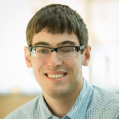{: .align-left}

### Ryan Muther, Digital Sirah Project

Ryan Muther is a PhD student in the Computer Science program at Northeastern University advised by Professor David Smith. He is interested in applying techniques from natural language processing to archival data to address questions in disciplines outside of computer science. Prior to joining the PhD program in 2016, he earned his Bachelor of Science degree from Union College in Computer Science and History. While working with David Smith, Ryan has worked on applying and improving text reuse analysis algorithms to a variety of domains, ranging from modeling editing in US Congressional bills to tracking the spread of news in a multilingual corpus of 19th centurynewspapers. His work with Congressional bills was written up as Charting the Changes: Modeling Edits in the Lawmaking Process and presented at the 2017 PoliInformatics workshop in Seattle, WA.For the Kitab project, Ryan is working on developing improved models of text reuse that will help the humanists on the team more easily find and understand how Ibn Ishaq’s work was reused and modified by later authors. In terms of broader goals, he would like to better understand how to integrate domain knowledge from experts to build better models of historical linguistic phenomena from archival data.

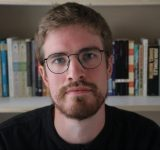{: .align-left}

### Gowaart Van Den Bossche, Post-Doctoral Fellow
Gowaart Van Den Bossche studied History and Arabic and Islamic Studies at Ghent University and the Netherlands-Flemish Institute in Cairo. He obtained his PhD in history at Ghent University in January 2019 with a dissertation entitled “The Past, Panegyric, and the Performance of Penmanship: Sultanic Biography and Social Practice in Late Medieval Egypt and Syria”, a detailed textual analysis and contextualisation of six sultans’ biographies written by two authors from the early Mamluk period, Ibn ʿAbd al-Ẓāhir (d. 1293) and Shāfiʿ b. ʿAlī (d. 1330). He is generally interested in the narrative qualities of historiography and the ways in which authors made use of literary forms of expression in medieval Islamic written culture.

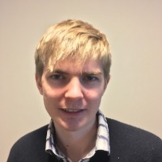{: .align-left}

### Mathew Barber, Research Associate (Digital Sirah Project)
Mathew Barber is a PhD Candidate at the department of Middle Eastern Studies in the University of Edinburgh. His doctoral research (entitled: ‘Text reuse and memory in Egypt: al-Maqrīzī’s muqaffā as a lost Fatimid source for the vizierate of al-Yāzūrī (r. 1050–8).’) analyses patterns of text reuse in the Egyptian historiography to shed light on lost Fatimid sources. He is interested more broadly in the representation of the Fatimids in Egyptian historical memory through the study of text reuse. Contemporary sources for the Fatimids are rare, especially for the eleventh and twelfth centuries, but later Egyptian historical writing on the Fatimids (especially the Mamluk historiography) is especially rich. As such, he is excited about the possibilities that digital humanities could bring to this field, providing insights into the composition of Egyptian historiography and potentially lost Fatimid texts and traditions.

KITAB’s team is supported by many members of the AKU computing staff, including: 

- Jonathan Hughes 
- Markus Bushell
- Eugene O’Donnell
- Mohammad Fahd
- Omer Manya
- Rafay Hassan.

# Our Partners

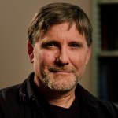{: .align-left}

**Gregory Crane** is the Alexander von Humboldt Chair in Digital Humanities at Leipzig University and Editor-in-Chief of the Perseus Digital Library, hosted at Tufts University. Professor Crane and his teams at Tufts and Leipzig have developed the largest online, annotated repository of Greek and Latin texts and also advised and facilitated the exchange of knowledge about corpus building, digital methods, and data analytics for many other projects. His most recent initiative is focused on “Global Philology.”

{: .align-left}

**David Smith** is an Assistant Professor in the College of Computer and Information Science at Northeastern University and a founding member of the NULab for Texts, Maps, and Networks, Northeastern’s center for the digital humanities and computational social sciences. Previously, he was a research faculty member at the University of Massachusetts’ Center for Intelligent Information Retrieval, a Ph.D. student in computer science at Johns Hopkins University, and the head programmer at the Perseus Digital Library Project. His research focuses on building statistical models of human language, with applications to information retrieval, machine translation, the humanities, and social sciences. Most recently, he has been working on inference for social networks from textual evidence, in collaboration with colleagues in English, history, and political science, under the aegis of the Proteus and Viral Texts projects.

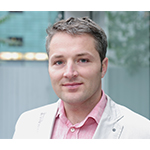{: .align-left}

**Marco Büchler** holds a Diploma in Computer Science. Since 2006 he has worked as a Research Associate in the Natural Language Processing Group at Leipzig University. From April 2008 to March 2011 Marco served as the technical Project Manager for the eAQUA project and continued to work in the capacity for the following eTRACES project. In March 2013 he received his PhD in the field of eHumanities. Since May 2014 he leads a Digital Humanities Research Group at the Göttingen Centre for Digital Humanities. His research includes Natural Language Processing on Big Humanities Data. Specifically, he works on Historical Text Re-use Detection and its application in the business world. In addition to his primary responsibilities, Marco manages the Medusa project (Big Scale co-occurrence and ngram framework) as well as the TRACER framework for detecting historical text re-use.

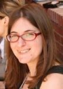{: .align-left}

**Tara Andrews** has been University Professor of Digital Humanities at the University of Vienna since 2016. With a Bachelor of Science in Humanities and Engineering from the Massachusetts Institute of Technology (1999), and the degrees of Master (2005) and Doctor (2009) of Philosophy in Byzantine and Armenian studies from the University of Oxford, her dual scientific training as well as her professional experience in the software industry has provided valuable and rare perspectives on the use of digital and computational methods in humanities domains. Andrews’ fields of expertise include the history and historiography of the Christian Near East in the tenth to twelfth centuries, the application of computational and statistical methods for reconstruction of the copying history of ancient and medieval manuscripts (stemmatology), and reflection on the implications of employing digital media and computational methods in humanities contexts. She has been invited to give keynote presentations at both academic and industry conferences, has contributed to both the Armenian-source content and the technical maintenance of the online “Prosopography of the Byzantine World”, has edited or co-edited two collections of papers on the subject of software and computational analysis in textual studies, and has published several journal articles as well as a monograph on topics that cover both medieval Armenian history and digital scholarly practice. Her scientific output also extends to research software, most notably the [‘Stemmaweb’ suite of online tools](https://stemmaweb.net/) for analysis of text variants and their associated stemma hypotheses, but also including a range of smaller tools whose source code has been released to the public on Github.

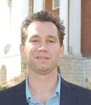{: .align-left}

**Matthew Thomas Miller**, PhD. is Assistant Professor of Persian Literature and Digital Humanities at Roshan Institute for Persian Studies at the University of Maryland, College Park. He also serves as the Associate Director of the [Roshan Initiative in Persian Digital Humanities (PersDig@UMD)](http://persdig.umd.edu/) and as the co-PI for the multi-institutional [Open Islamicate Texts Initiative (OpenITI)](https://iti-corpus.github.io/) and the [Persian Manuscript Initiative (PMI)](http://www.persianmanuscript.org/). His research focuses on medieval Sufi literature, the history of sexuality and the body, and digital humanities. He currently is working on a book project, entitled Embodying the Beloved: Embodiment and Mystical Modes of Meaning Creation in Medieval Persian Sufi Literature, and a number of articles on computational or “distant reading” approaches to Persian literature and carnivalesque Sufi poetry.

# Advisory Board

* Antoine Borrut, University of Maryland
* Julia Bray, Oxford University
* Fred Donner, University of Chicago
* Walid Ghali, AKU-ISMC
* Hugh Kennedy, SOAS, University of London
* Chase Robinson, City University of New York, Graduate Center
* Shawkat Toorawa, Cornell University
* Konrad Hirschler, SOAS, University of London

# User Group

* Arezou Azad, University of Birmingham
* David Bennett, University of Gottenburg
* Edward Coghill, University of Oxford
* Maryam Ghadyani, AKU-ISMC
* Virginia Vázquez Hernández, Centro de Ciencias Humanas y Sociales
* Ryan Lynch, University of Oxford, Oriental Studies Department
* Majied Robinson, Edinburgh University
* Isabel Toral-Niehoff, Göttingen University
* James Weaver, University of Zurich
* Luke Yarbrough, Saint Louis University
* Najam Haider, Barnard College/Columbia University

# Research Based on KITAB

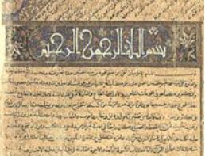{: .align-left}  

## Cultural Memory in the Pre-Modern Middle East: Köprülü 01589, A Library Manuscript

This paper features my first application of KITAB’s text reuse detection methods to a manuscript transcription. It was delivered Nov. 22, 2015 at the Middle East Studies Annual Meeting in Denver for a panel entitled “Imagining the Ummah.” The panel papers focused on the composition, meaning, and reception of sources pertaining to the first centuries of the Muslim community (600-1000). The paper’s contents (which reflect oral delivery, the audience, and the 20 minute time limit) will be revised, expanded, and incorporated into my 2017 University of Leiden LUCIS lectures. [Read more…](http://web.kitab-project.org/wp-content/uploads/2016/04/MESA2015paper.pdf)

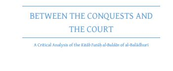{: .align-left}  

## Oxford PhD Thesis uses KITAB to Assess Reception History of Major Arabic Book on the Early Caliphate

The *Futūḥ al-buldān* by Aḥmad Ibn Yaḥyā al-Balādhurī (died c. 892) is a most important source for our knowledge of the early Islamic caliphate. In his 2016 Oxford PhD thesis, Ryan Lynch uses KITAB to identify the types of material that later authors borrowed from the *Futūḥ*. He is the first scholar to extensively study the reception of the *Futūḥ* and shows the significant impact al-Balādhurī’s book had on subsequent generations. Later authors liberally borrowed from al-Balādhurī’s book, often without giving him credit. A famous work on geography from the thirteenth century known as the *Muʿjam al-buldān* ("Dictionary of Countries"), for example, features verbatim material from almost every part of al-Balādhurī’s book – running from the Prophet Muḥammad’s *hijra* to Medina through to the conquests of South Asia.

